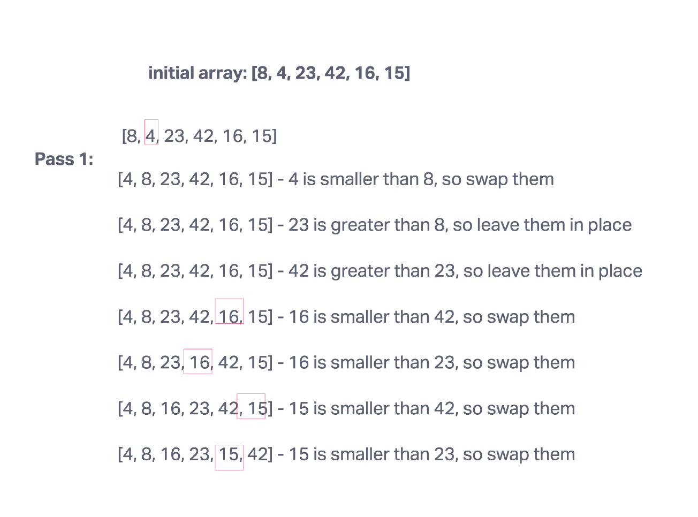
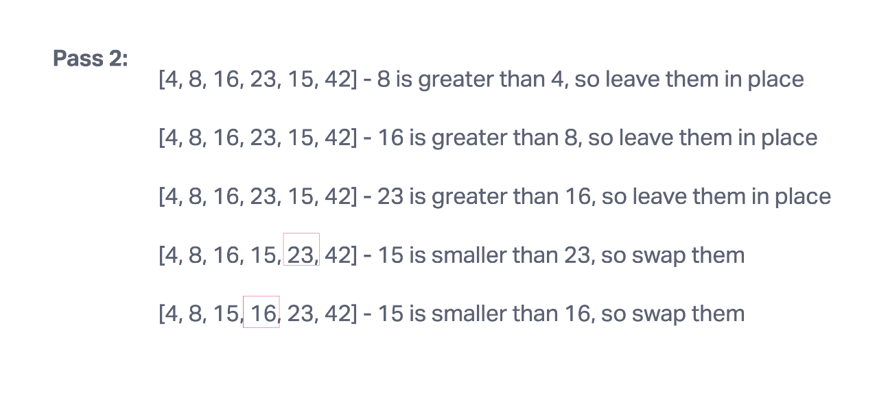
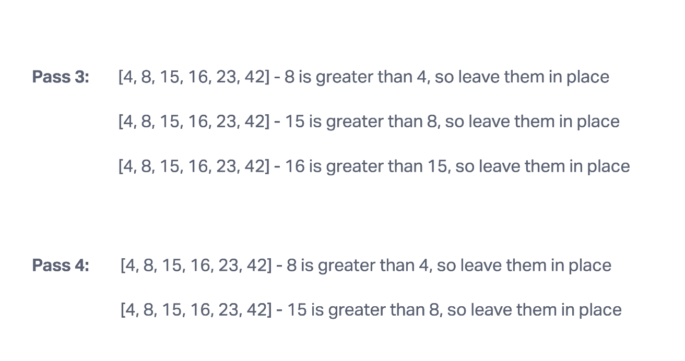
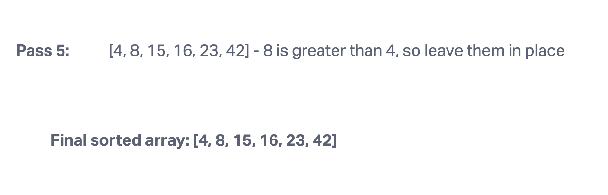

#### Pseudocode
Insert(int[] sorted, int value)
  initialize i to 0
  WHILE value > sorted[i]
    set i to i + 1
  WHILE i < sorted.length
    set temp to sorted[i]
    set sorted[i] to value
    set value to temp
    set i to i + 1
  append value to sorted

InsertionSort(int[] input)
  LET sorted = New Empty Array
  sorted[0] = input[0]
  FOR i from 1 up to input.length
    Insert(sorted, input[i])
  return sorted

Input: [8,4,23,42,16,15]
output: [4,8,15,16,23,42]

#### Algorithm
1. Start with the second element in the array
2. Compare the second element with the one before it and swap if necessary
3. Continue to the next element and if it is in the incorrect order, iterate through the sorted portion (i.e. the left side) to place the element in the correct place
4. Repeat until the array is sorted

#### Efficiency
* Time: O(n^2)
* Space: O(1)

#### Visualization

