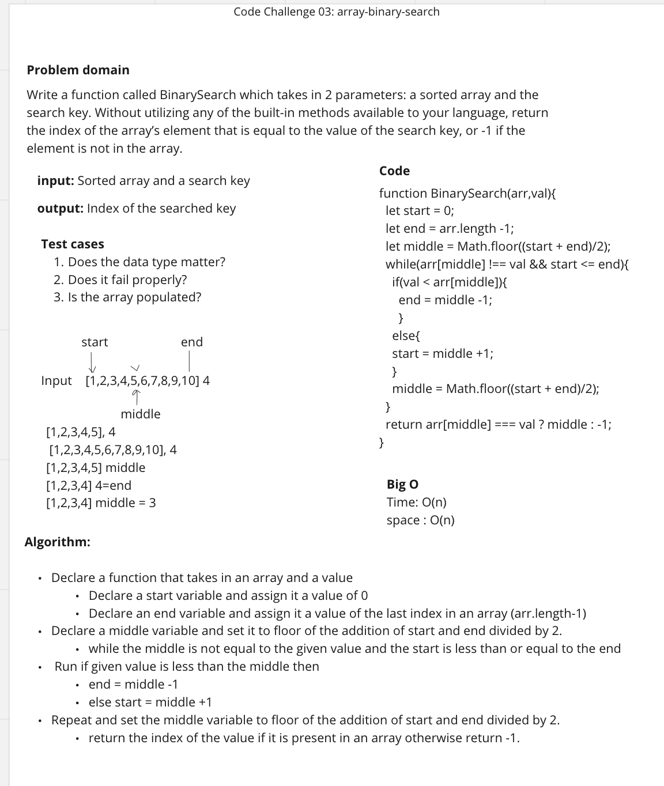

#### array-binary-search

Write a function called BinarySearch which takes in 2 parameters: a sorted array and the search key. Without utilizing any of the built-in methods available to your language, return the index of the array’s element that is equal to the value of the search key, or -1 if the element is not in the array.

## Whiteboard Process

## Approach & Efficiency

I worked with Rafael for this code challenge. We decided to go with while loop as built-in methods were not allowed. We went with an approach where we divided the given array in half and checked that value with the given input. If the value was less than the middle then we shifted the end to be middle -1 and if it was greater then we shifted the start to be middle +1 until we found the value. And if the value is not present then our function will return -1.

Big O :
Time : O(n)
Space : O(n)