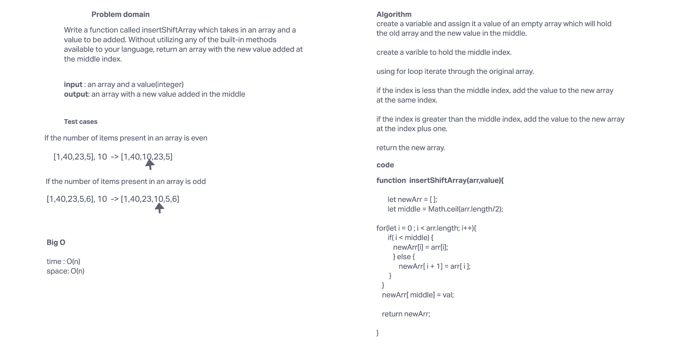

# Insert to Middle of an Array
Write a function called insertShiftArray which takes in an array and a value to be added. Without utilizing any of the built-in methods available to your language, return an array with the new value added at the middle index.

## Whiteboard Process

## Approach & Efficiency
<!-- What approach did you take? Discuss Why. What is the Big O space/time for this approach? -->
I decided to use for loop for this challenge. I also created an empty array and added the elements in it until the middle index is found. After that the new value gets inserted there and the rest of the array is added in the new 
array. 
I chose this approach as we were not allowed to use built-in methods like push, so this was the option that worked for me.

Big O :
time O(n)
space O(n)