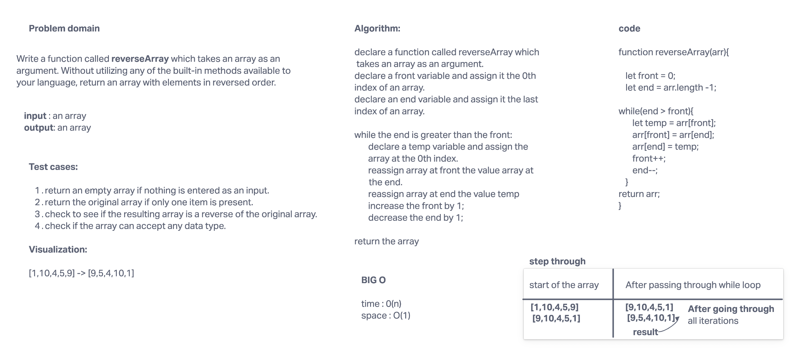

# Reverse an Array
Write a function called reverseArray which takes an array as an argument. Without utilizing any of the built-in methods available to your language, return an array with elements in reversed order.

## Whiteboard Process

## Approach & Efficiency
<!-- What approach did you take? Discuss Why. What is the Big O space/time for this approach? -->

For solving this problem, I used while loop. As we were not allowed to use any built-in function, while loop was the way to go. 
By using while loop, I was able to reverse the array in its place and didn't need to use a new array to push the results. 
The Big O for this approach -> time O(n)   space O(1)