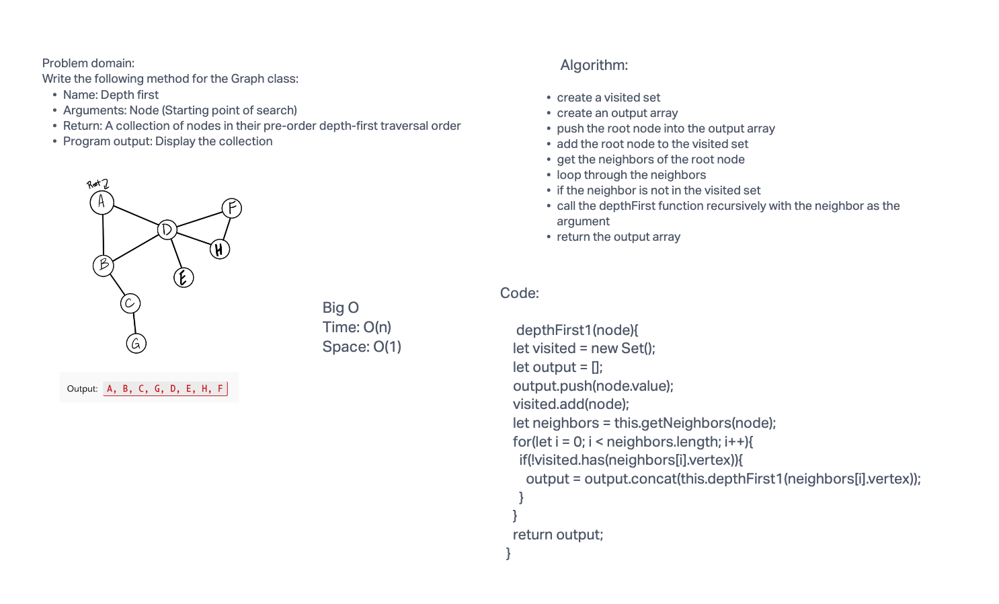

#### graphs

methods:

1. add node
Arguments: value
Returns: The added node
Add a node to the graph

2. add edge
Arguments: 2 nodes to be connected by the edge, weight (optional)
Returns: nothing
Adds a new edge between two nodes in the graph
If specified, assign a weight to the edge
Both nodes should already be in the Graph

3. get nodes
Arguments: none
Returns all of the nodes in the graph as a collection (set, list, or similar)
Empty collection returned if there are no nodes

4. get neighbors
Arguments: node
Returns a collection of edges connected to the given node
Include the weight of the connection in the returned collection
Empty collection returned if there are no nodes

5. size
Arguments: none
Returns the total number of nodes in the graph
0 if there are none

6. breadth first traversal
Arguments: node
Returns a collection of nodes in the order they were visited
Display the collection

7. Business Challenge
Arguments: graph, array of city names
Return: the cost of the trip (if it’s possible) or null (if not)

