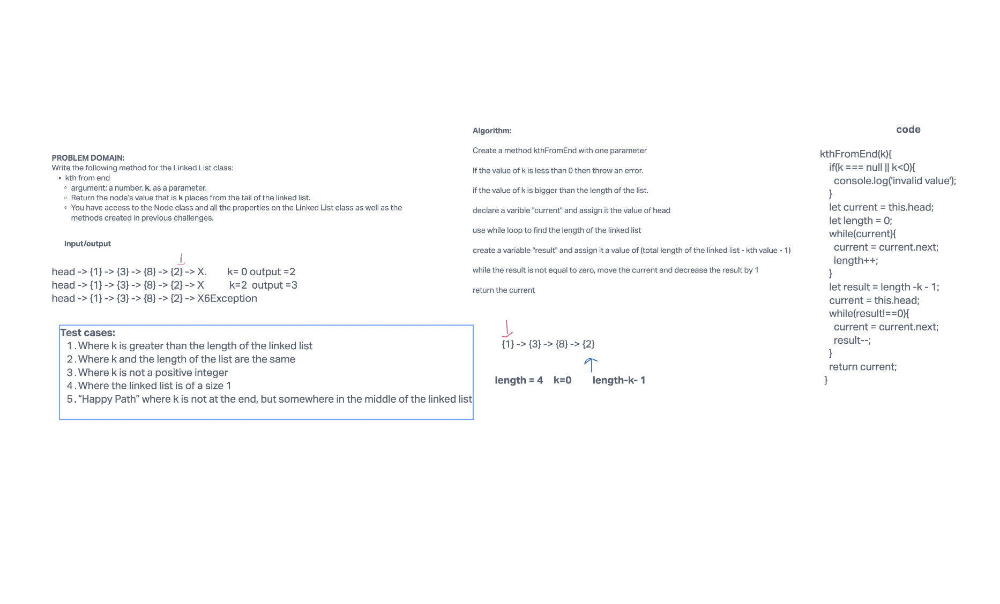
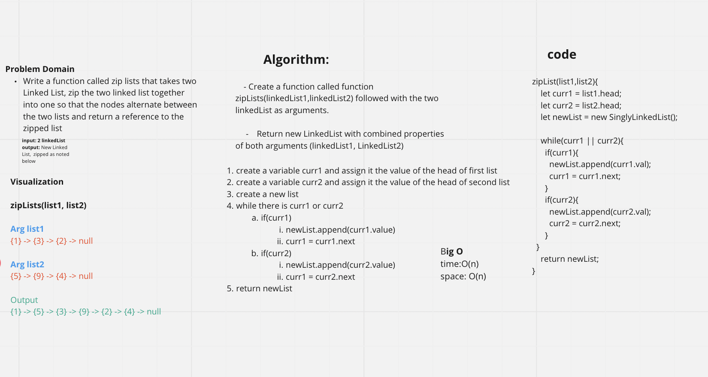

#### singly linked list

Author: Ashwini Uppal

## challenge summary

#### lab05
Creat a linked list class and implemented methods like insert, includes and toString.

#### lab06
Implement methods like 
append: which will add a new node with the given value to the end of the list
insert before: which will add a new node with the given new value immediately before the first node that has the value specified
insert after : which will add a new node with the given new value immediately after the first node that has the value specified

## Approach and efficiency

#### code challenge 05
I created a sigly linked list where I checked :
1. If there is anything present in the list. If the list is empty then the new node will
become the head for that list. 
2. For the insert method, new node will be added as a .next property for the existing head. 
3. For includes method, the current variable will start from the head and will keep going to next until it finds the value that we are looking for.
4. For toString method, a variablw will keep track of all the values in the list and update it with each iteration and return all the values
present in the list.

## code challenge 06
I worked with Marcus for this code challenge. 
Method: append()
1. Create a new node
2. If there is no head, then the new node is the head
3. If there is a head then the new node is the new tail
Method: insertBefore()
1. create a variable and assign it the value of head
2. If the value is the head then the new node is the head
3. while there is a current node
4. If the current node's next value is the new value given, then the new node is the current node's next

Method: insertAfter()
1. Create a new node
2. Create a variable and assign it the value of head
3. While there is a current node
    If the current node's value is the new value given then the new node is the current node's next

[Whiteboard for linked-list-insertions](../linked-list/assets/linked-list-insertions.png)

####code challenge 07

## problem domain
Write the following method for the Linked List class:
kth from end
argument: a number, k, as a parameter.
Return the node’s value that is k places from the tail of the linked list.
You have access to the Node class and all the properties on the Linked List class as well as the methods created in previous challenges.

I worked with Adrienne for this code challenge

method: kthFromEnd(k)
We implemented the following steps:
Create a method kthFromEnd with one parameter
If the value of k is less than 0 then throw an error.
if the value of k is bigger than the length of the list.
declare a varible "current" and assign it the value of head
use while loop to find the length of the linked list
create a variable "result" and assign it a value of (total length of the linked list - kth value - 1)
while the result is not equal to zero, move the current and decrease the result by 1
return the current 

 ### code challenge 08

## problem domain
Write the following method for the Linked List class:
zipLists
Arguments: 2 linked lists
Return: Linked List, zipped as noted below

I worked with Brenda and Eli for this code challenge. 

## method: zipLists(list1, list2)
We implemented the following steps:
Create a method zipLists with two parameters
Create a new linked list
Create a variable "current1" and assign it the value of list1.head
Create a variable "current2" and assign it the value of list2.head
while current1 is not null and current2 is not null
    append the current1 value to the new linked list
    append the current2 value to the new linked list
    move the current1 to the next node
    move the current2 to the next node
if current1 is not null
    append the current1 value to the new linked list
    move the current1 to the next node
if current2 is not null
    append the current2 value to the new linked list
    move the current2 to the next node
return the new linked list

