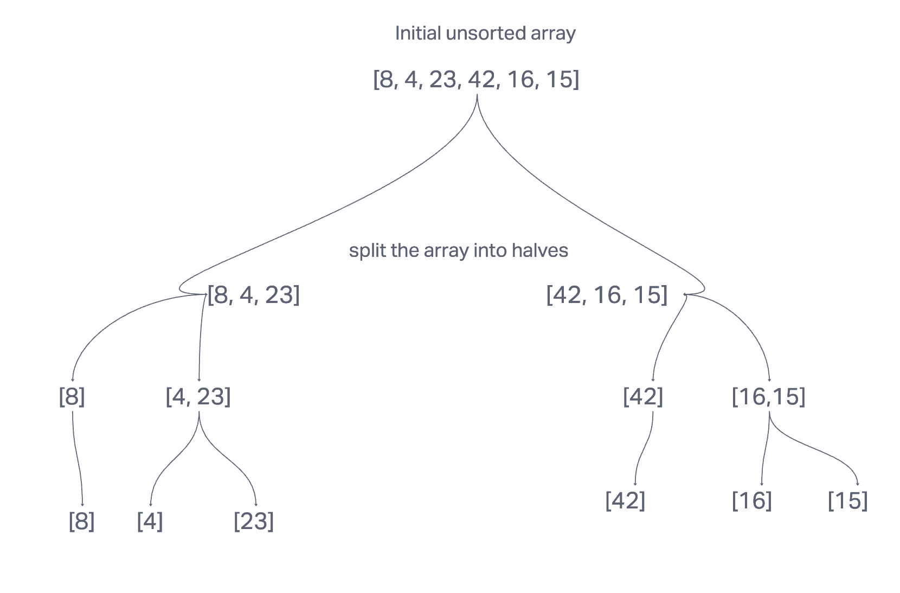
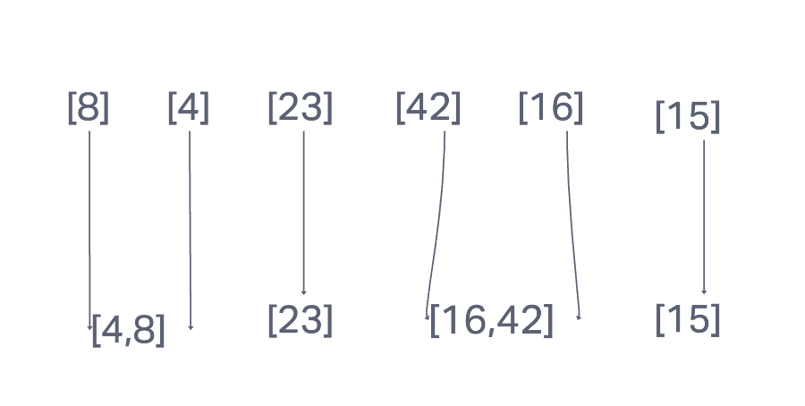
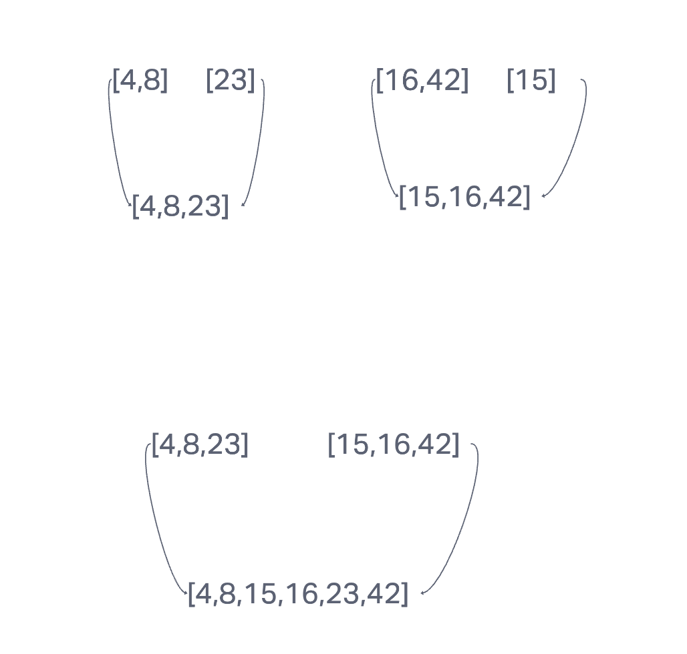

#### merge sort

#### Pseudo Code

function mergeSort(array) {
    if (array.length <= 1) {
        return array;
    }

    // Split the array into halves
    const middle = Math.floor(array.length / 2);
    const leftHalf = array.slice(0, middle);
    const rightHalf = array.slice(middle);

    // Recursively sort each half
    const sortedLeftHalf = mergeSort(leftHalf);
    const sortedRightHalf = mergeSort(rightHalf);

    // Merge the sorted halves back together
    return merge(sortedLeftHalf, sortedRightHalf);
}

function merge(leftHalf, rightHalf) {
    const result = [];

    while (leftHalf.length > 0 && rightHalf.length > 0) {
        if (leftHalf[0] <= rightHalf[0]) {
            result.push(leftHalf[0]);
            leftHalf.shift();
        } else {
            result.push(rightHalf[0]);
            rightHalf.shift();
        }
    }

    // Add any remaining elements to result
    if (leftHalf.length > 0) {
        result.push(...leftHalf);
    } else {
        result.push(...rightHalf);
    }

    return result;
}

#### Algorithm

1. Divide the unsorted list into n sublists, each containing 1 element (a list of 1 element is considered sorted).
2. Repeatedly merge sublists to produce new sorted sublists until there is only 1 sublist remaining. This will be the sorted list.

#### Efficiency

* Time: O(n log n)
* Space: O(n)

#### Visualization

