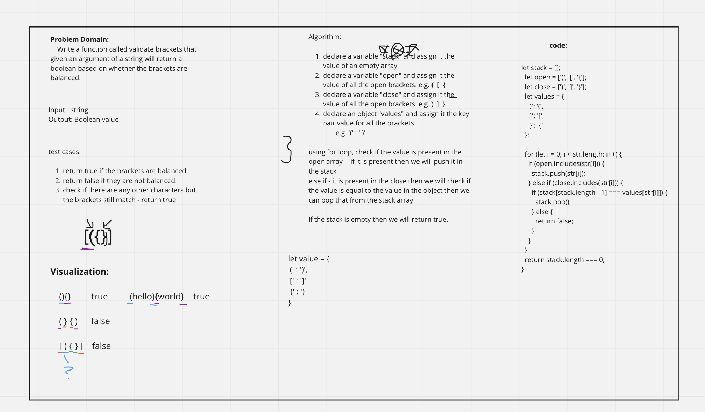

## stack-queue-brackets

### Challenge

Write a function called validate brackets that takes in a string and returns a boolean if the brackets are balanced or not.

### Approach & Efficiency

I worked with Jonathan on this assignment. We decided to declare a variable called stack and set it equal to an empty array. 
We also declare open and close variables and set the values of open brackets in open and close brackets in close. 
We declare an object called values and set the values of open brackets to their corresponding close brackets.
We then loop through the string and if the character is an open bracket we push it to the stack. If the character is a close bracket we pop the last element off the stack and compare it to the values object. If the values object does not have the character as a key or the value of the key does not match the character we return false. 
If the stack is not empty at the end we return false. If the loop finishes we return true.

### API

* validateBrackets(string): takes in a string and returns a boolean if the brackets are balanced or not.

## testing

We tested our function by console logging the function and passing in a string with balanced brackets and a string with unbalanced brackets.
We also tested our function by passing in a string with balanced brackets and a string with unbalanced brackets and using extra characters in the string.

## whiteboarding

