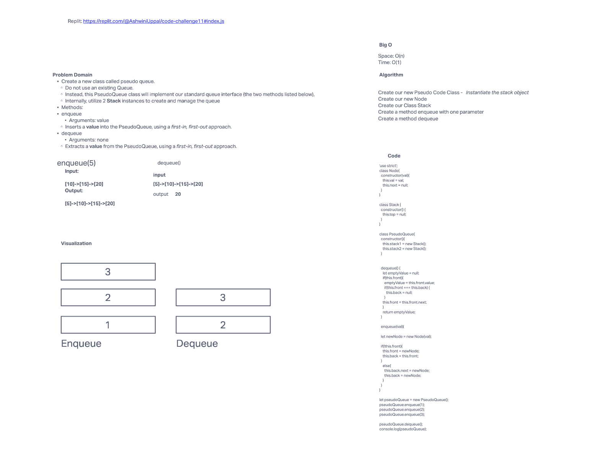

## stack-queue-pseudo

<!-- Short summary or background information -->
Create a class called PseudoQueue that has two stacks as properties. The class should have enqueue and dequeue methods that use the stacks to add and remove values from the queue.

## Challenge

<!-- Description of the challenge -->
Define the following methods for the PseudoQueue class:
* enqueue
  * Arguments: value
  * Adds a new node with that value to the back of the queue with an O(1) Time performance.

* dequeue
  * Arguments: none
  * Returns: the value from node from the front of the queue
  * Removes the node from the front of the queue
  * Should raise exception when called on empty queue

## Approach & Efficiency

<!-- What approach did you take? Why? What is the Big O space/time for this approach? -->
First I created a pseudoQueue class that has two stacks as properties. 
Then I created a enqueue method that adds a new node with that value to the back of the queue with an O(1) Time performance. Then I created a dequeue method that returns the value from node from the front of the queue and removes the node from the front of the queue.

## API
<!-- Description of each method publicly available to your PseudoQueue -->
* enqueue
* dequeue

I worked with John on this code challenge.