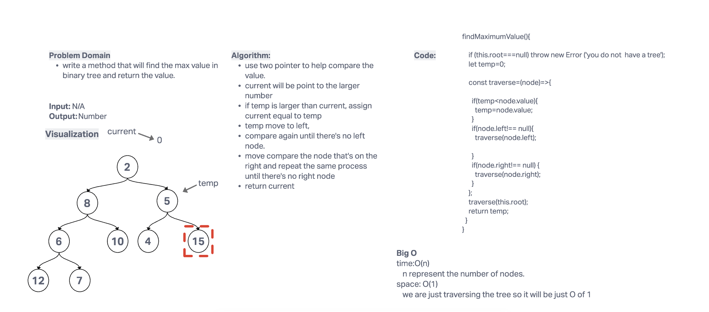
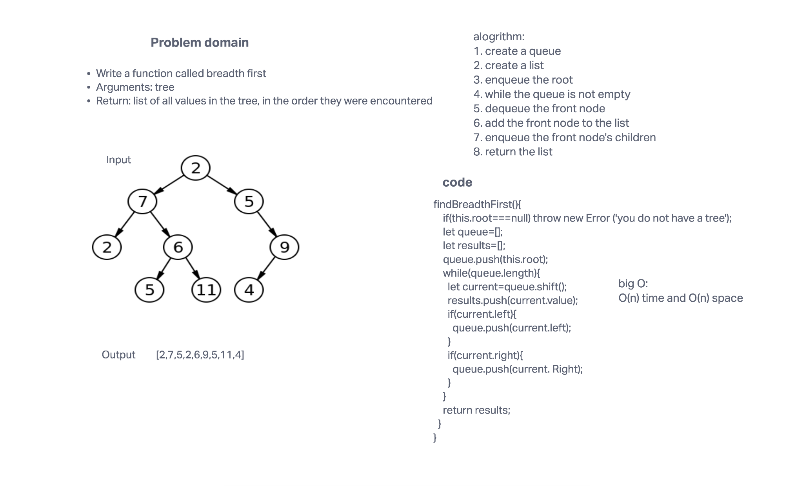

# Trees
<!-- Short summary or background information -->
Implement a tree data structure. A tree is a non-linear data structure that can have any number of child nodes. A tree has a root node, and each node has a value and a list of child nodes. A tree is a data structure that consists of nodes in a parent / child relationship. The top node in a tree is called the root. Every node other than the root is associated with one parent node. A node can have an arbitrary number of child nodes.

## Challenge
<!-- Description of the challenge -->

Node
Create a Node class that has properties for the value stored in the node, the left child node, and the right child node.
Binary Tree
Create a Binary Tree class
Define a method for each of the depth first traversals:
pre order
in order
post order
find the maximum value

Each depth first traversal method should return an array of values, ordered appropriately.
Binary Search Tree
Create a Binary Search Tree class
This class should be a sub-class (or your languages equivalent) of the Binary Tree Class, with the following additional methods:
Add
Arguments: value
Return: nothing
Adds a new node with that value in the correct location in the binary search tree.
Contains
Argument: value
Returns: boolean indicating whether or not the value is in the tree at least once.

## Approach & Efficiency
<!-- What approach did you take? Why? What is the Big O space/time for this approach? -->
For this code challenge I used the following approach:
1. Create a Node class that has properties for the value stored in the node, the left child node, and the right child node.
2. Create a Binary Tree class
3. Define a method for each of the depth first traversals:
pre order
in order
post order
4. Each depth first traversal method should return an array of values, ordered appropriately.
5. Create a Binary Search Tree class
6. This class should be a sub-class (or your languages equivalent) of the Binary Tree Class, with the following additional methods:
Add
Arguments: value
Return: nothing
Adds a new node with that value in the correct location in the binary search tree.
Contains
Argument: value
Returns: boolean indicating whether or not the value is in the tree at least once.
findBreadthFirst
alogrithm:
1. create a queue
2. create a list
3. enqueue the root
4. while the queue is not empty
5. dequeue the front node
6. add the front node to the list
7. enqueue the front node's children
8. return the list
big O: O(n) time and O(n) space

## API
<!-- Description of each method publicly available in each of your trees -->
preOrder()
inOrder()
postOrder()
add()
contains()
findMaximumValue()
findBreadthFirst()

##whiteboard
 

